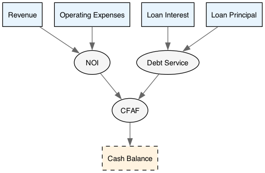

# Loan with Schedule -- Multi-Periodicity

A monthly operating model with a quarterly term loan originated on a non-standard date. The loan schedule runs at its own periodicity (quarterly from Feb 15) with business day adjustments, while the operating model runs monthly from Jan 1.

This example demonstrates the key multi-periodicity pattern: `Schedule.to_events` + `Series.of_events` bridges loan payments from the quarterly schedule into the monthly model timeline.

## Loan Terms

| Parameter            | Value                 |
| -------------------- | --------------------- |
| Loan Amount          | $10,000,000           |
| Annual Interest Rate | 6.500%                |
| Term                 | 20 quarters (5 years) |
| Day Count Convention | Actual/360            |
| Issuance Date        | 2025-02-15            |
| Maturity Date        | 2030-02-15            |
| Business Day Conv.   | Modified Following    |
| Quarterly Payment    | $589,659.71           |

## Key Patterns

### Two Timelines

The model uses two timelines simultaneously:

- **Model timeline**: 60 monthly periods from Jan 2025 (shared by all series)
- **Loan timeline**: 20 quarterly periods from Feb 15, 2025 (from `Schedule.to_timeline`)

### Schedule Conventions

`Schedule.make` generates boundary dates with:

- **Roll**: Same day (default) -- maintain the 15th across months
- **BDC**: Modified Following -- shift weekend dates to the next business day, unless it crosses a month boundary
- **Stub**: Short First (default) -- backward generation from maturity

### Unadjusted vs Adjusted Dates

Interest accrual uses **unadjusted** periods (contractual coupon dates), while cash movement uses **adjusted** dates (after BDC). For example, Nov 15, 2025 falls on a Saturday and shifts to Nov 17 for payment, but the interest accrual period still runs from the unadjusted Aug 15 to Nov 15.

### Multi-Periodicity Bridge

Quarterly loan payments are placed into the monthly model via:

```ocaml
let monthly_interest =
  let interest_vals = Series.eval loan_tl interest_pmt in
  Series.of_events ~name:"Loan Interest"
    (Schedule.to_events (fun i _p -> interest_vals.(i)) loan_sched)
```

`Schedule.to_events` produces `(Date.t * float) list` and `Series.of_events` bins them into whatever timeline the series is evaluated against. The quarterly payment lands in the single month containing the adjusted payment date.

## Statement Structure

```text
Monthly Cash Flow
  Revenue
  Operating Expenses
  NOI
  Debt Service
    Interest
    Principal
  CFAF
  Cash Balance
```

## Dependency Graph



## Run

```
dune exec next/examples/07-loan-with-schedule/main.exe
```

## Sample Output

```text
=== Loan with Schedule: Multi-Periodicity Demo ===

LOAN SCHEDULE
=============
Issuance:        2025-02-15
Maturity:        2030-02-15
Amount:          $10000000
Rate:            6.50%
Periods:         20 quarters
Quarterly PMT:   $589659.71

BOUNDARY DATES (first 8)
========================
  #    Unadjusted      Adjusted  Shift
---------------------------------------------
  0    2025-02-15    2025-02-15
  1    2025-05-15    2025-05-15
  2    2025-08-15    2025-08-15
  3    2025-11-15    2025-11-17  +2 days
  4    2026-02-15    2026-02-16  +1 days
  ...

LOAN AMORTIZATION (first 8 quarters)
=====================================
  Q      Pay Date     Beg Balance      Interest     Principal     End Balance
---------------------------------------------------------------------------
  1    2025-05-15     10000000.00     160694.44     428965.26      9571034.74
  2    2025-08-15      9571034.74     158985.52     430674.19      9140360.55
  3    2025-11-17      9140360.55     151831.54     437828.16      8702532.39
  ...

MONTHLY MODEL (first 12 months)
===============================

                             2025-01-01    2025-02-01    2025-03-01  ...
=========================================================================
Monthly Cash Flow
  Revenue                        500000        503333        506667  ...
  Operating Expenses            -200000       -200500       -201000  ...
  NOI                            300000        302833        305667  ...
Debt Service
  Interest                            0       -160694             0  ...
  Principal                           0       -428965             0  ...
  Total Debt Service                  0       -589660             0  ...
=========================================================================
  CFAF                           300000       -286826        305667  ...
  Cash Balance                  2300000       2013174       2318840  ...
```

Notice how debt service appears only in months containing quarterly payment dates (Feb, May, Aug, Nov), with zero in all other months.
